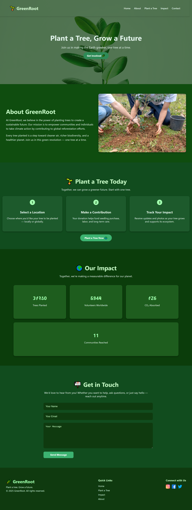

# 🌱 GreenRoot — Eco-Friendly Tree Planting Website

GreenRoot is a beautifully designed, responsive landing page website created to raise awareness about planting trees and protecting the environment. It encourages users to take action by planting trees, learning about the impact of their actions, and getting involved in sustainability efforts.

## 🌍 Live Demo

🔗 [View Website Live](https://usamamansoor026.github.io/greenRoot/)

## 📸 Preview

---

## ✨ Features

- 🔥 Full-screen hero banner with image overlay
- 📱 Mobile-first responsive design
- 🌳 About section with mission statement
- 🪴 Step-by-step "How to Plant a Tree" guide
- 📈 Impact statistics section
- 📬 Contact form
- 🔗 Footer with useful links & social icons
- 💚 Styled using modern CSS with custom color variables

---

## 🛠️ Tech Stack

- **HTML5**
- **CSS3**
- 💡 CSS Variables for theme consistency
- 📱 Responsive design with media queries
- ☁️ Unsplash images for high-quality backgrounds

---
